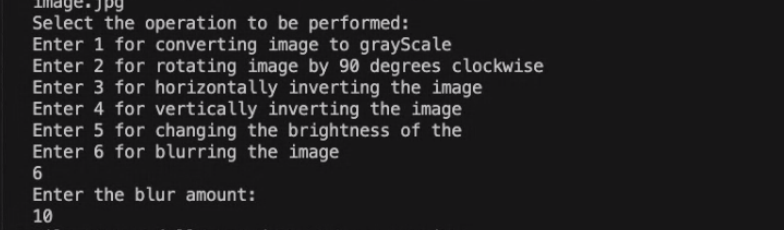
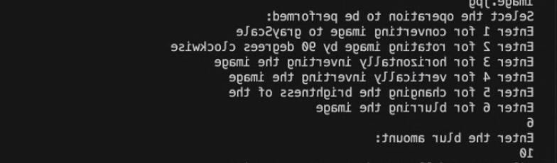
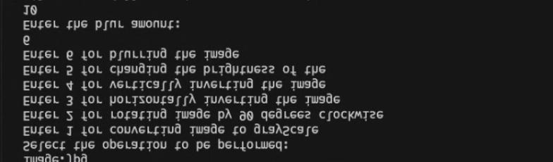
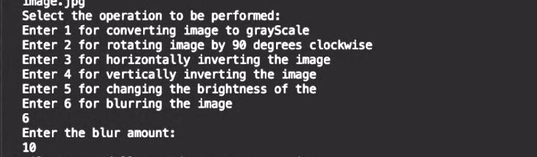
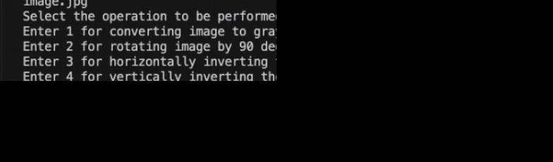
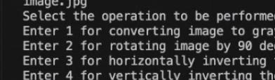

# Image_Editor
Java Image EditMagic is a simple image editing tool that allows you to perform various operations on images, such as converting to grayscale, rotating, inverting, adjusting brightness, and more.

The initial image is :- 

## Features

- *Convert to Grayscale:* Transform colored images into grayscale.
  

- *Rotate:* Rotate images 90 degrees clockwise.
  

- *Horizontal Invert:* Flip images horizontally.
  

- *Vertical Invert:* Flip images vertically.
  

- *Adjust Brightness:* Increase or decrease image brightness.
  

  *Crop Image:* crops the image .
  

  *Quatered Image:* reduces the size of image to quater of the original.
  

## Getting Started

Follow these steps to get started with the Java Image Editor:

### Prerequisites

- Java Installed on the device
- Any Java IDE.
- An Image.
  # Libraries Needed:-
  - javax.imageio.ImageIO;
  - java.awt.*;
  - java.awt.image.*;
  - java.io.File;
  - java.io.IOException;
  - java.nio.Buffer;
  - java.util.Scanner;
### All the Functions Explanations:-
1) GrayScaling : here i first enter the height and width of the image .THen i used the nested for loop where i printed the pixel values of the image. Then i stored the pixel values in the buffered image and thne used the inbuilt function of TYPE_BYTE_GRAY to convert to gray scale and got the final output editing .
   
2)  invertedImage : Here I First get the height and width of the image which i need to edit. Then I created a new bufferred Image in which I append the new changes. Then I used a nested for loop for getting the particular pixel values of the image, then i set the values according to the need in the new bufferred image. This runs and successfully creates a result image in the current working directory with name VerticallyrotatedImage.jpg.
   
3) transposeImage : Here I First get the height and width of the image which i need to edit. Then I created a new bufferred Image in which I append the new changes. Then I used a nested for loop for getting the particular pixel values of the image, then I set the all the pixel values and set the columns and rows values in the new bufferred image and gave it the pixel values of the image rows and columns. This runs and successfully creates a result image in the current working directory with name transposedImage.jpg.

4) changeBrightness : Here I First get the height and width of the image which i need to edit. Then I created a new bufferred Image in which I append the new changes. After which I increased the red, green and blue pixel values by 100 percent and if it exceeds 255 then i set it to 255 and similarly if it decreases from 0 then i set i to 0.This runs and successfully creates a result image in the current working directory with name changedBrightnessImage.jpg.   

5) printPixelValues : Here I First get the height and width of the image which i need to edit. Then I created a new bufferred Image in which I append the new changes. Then I used a nested for loop for getting the particular pixel values of the image. Here the values which i get is of 32 bits out of which the first 8 bits are red pixel values and next 8 is of blue and next 8 of green and last 8 is the tranparency value. We cannot access these values directly so we use the color object to get those values. Color object have a method called 'getRed()' which gives the first 8 bits of the long 32 bits, similarly we can use the inbuilt functions to get the values of blue, green, transparency.

6) horizontalInvertedImage : Here I First get the height and width of the image which i need to edit. Then I created a new bufferred Image in which I append the new changes. Then I used a nested for loop for getting the particular pixel values of the image, then i set the values according to the need in the new bufferred image. This runs and successfully creates a result image in the current working directory with name horizontalInvertedImage.jpg.

7)croppedImage :Here i first get the height and width of the image which i need to edit.Then i created a new buffered image in which i append the changes .Then I used a nested for loop for getting the particular pixel values of the image , then i iterated the outer loop till height by 2 and the inner loop till width by 2 to crop the given image . This image got stored in the buffered image created and the code runs succesfully and create a working directory with new name cropImage.jpg .

### Usage
- Open the project in your favorite Java IDE (e.g., Eclipse, IntelliJ IDEA).

- Run the ImageEditor.java file.
- You will be presented with a menu of options:
- Convert to Grayscale: Converts the image to grayscale and saves it.
- Rotate: Rotates the image 90 degrees clockwise and saves it.
- Horizontal Invert: Flips the image horizontally and saves it.
- Vertical Invert: Flips the image vertically and saves it.
- Adjust Brightness: Adjusts the image brightness and saves it.
- Exit: Quits the image editor.
- Follow the on-screen instructions to perform the desired operation on your image.
- After selecting the option the result image would be saved in the current working directory.
  

### Examples

// Load an image

BufferedImage inputImage = ImageIO.read(new File("input.jpg"));

// Convert the image to grayscale

BufferedImage grayScaleImage = ImageEditor.convertToGrayScale(inputImage);
ImageIO.write(grayScaleImage, "jpg", new File("grayscale.jpg"));

// Rotate the image 90 degrees clockwise

BufferedImage rotatedImage = ImageEditor.rotateClockwise(inputImage);
ImageIO.write(rotatedImage, "jpg", new File("rotated.jpg"));

// Adjust the brightness of the image by 20%

BufferedImage brightenedImage = ImageEditor.changeBrightness(inputImage, 20);
ImageIO.write(brightenedImage, "jpg", new File("brightened.jpg"))

